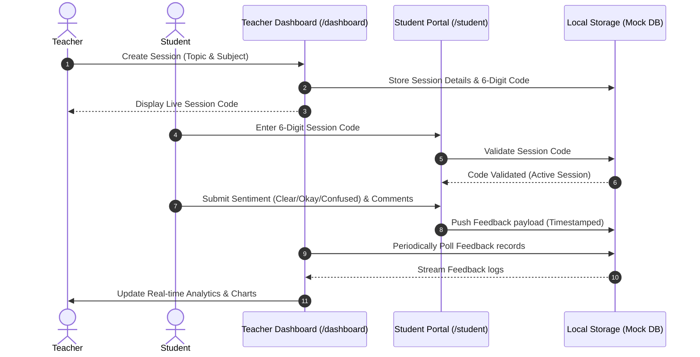

# LecturePulse 🎓

<div align="center">

[](https://github.com/rishima17/LecturePulse)
[](https://opensource.org/licenses/MIT)
[](https://github.com/rishima17/LecturePulse/pulls)
[](https://react.dev/)
[](https://tailwindcss.com/)

**Real-time student feedback application designed to bridge the communication gap between educators and students during live lectures.**

[Live Demo](https://lecturepulse.vercel.app/) • [Report Bug](https://github.com/rishima17/LecturePulse/issues) • [Request Feature](https://github.com/rishima17/LecturePulse/issues)

---

</div>

## 📖 Table of Contents

- [About LecturePulse](#-about-lecturepulse)
- [Core Features](#-core-features)
- [Tech Stack](#%EF%B8%8F-tech-stack)
- [System Architecture](#%EF%B8%8F-system-architecture)
- [Folder Structure](#-folder-structure)
- [Getting Started](#-getting-started)
- [Usage Guide](#-usage-guide)
- [SSOC Contribution Guidelines](#%EF%B8%8F-ssoc-contribution-guidelines)
- [Roadmap (Contributor Opportunities)](#-roadmap-contributor-opportunities)
- [License](#-license)
- [Contact](#-contact)

---

## 💡 About LecturePulse

In large classroom settings or online lectures, a common challenge is the feedback loop. Students often hesitate to interrupt a lecturer when they are confused, leading to gaps in understanding. Similarly, teachers lack real-time signals on whether their speed is optimal or if students are losing attention.

**LecturePulse** solves this by providing a lightweight, anonymous, and instant interface:
* **For Students**: A single tap allows them to broadcast their understanding status (Clear, Okay, Confused) and attention levels without interrupting the flow of the lecture.
* **For Teachers**: A dynamic dashboard aggregates student sentiment live, tracking analytics throughout the session to pinpoint exactly *when* confusion peaked.

---

## ✨ Core Features

### 👨‍🏫 Teacher Suite
- **Interactive Dashboard**: Instantly spawn new lectures, generate custom 6-digit session codes, and keep track of lecture history.
- **Real-Time Analytics**: Monitor live feedback distribution using interactive charts and visuals.
- **Detailed Session Reports**: Post-lecture summaries containing:
  - **Understanding Distribution**: Recharts pie charts displaying students' comprehension levels.
  - **Attention Index**: Gauge classroom attention level trends (High, Medium, Low).
  - **Confusion Timeline**: Track exactly when during the lecture students experienced difficulty.

### 🧑‍🎓 Student Portal
- **Zero-Barrier Access**: Join sessions instantly using a 6-digit session code—no registration or account setup required.
- **Complete Anonymity**: Encourages honest, unbiased feedback without fear of evaluation.
- **Live Sentiments**: Send instant comprehension updates (Clear 🟢, Okay 🟡, Confused 🔴) and update attention ratings with micro-animations.
- **Feedback Comments**: Drop short queries or comments to highlight specific doubts.

### 🎨 Visual & UX Excellence
- **Glassmorphism Theme**: A premium aesthetic using dark mode accents, modern gradients, and blur backdrops.
- **Micro-Animations**: Built with Framer Motion to provide tactile feedback and smooth screen transitions.
- **Responsive Layout**: Designed to work seamlessly across desktops, tablets, and mobile screens.

---

## 🛠️ Tech Stack

LecturePulse is built using a modern, performant, and scale-friendly frontend tech stack:

| Technology | Purpose | Key Benefits |
| :--- | :--- | :--- |
| **React 19** | Core UI Library | Declarative component structure, state management, and optimized rendering. |
| **Vite 7** | Build Tool & Bundler | Lightning-fast Hot Module Replacement (HMR) and optimized build processes. |
| **Tailwind CSS v4** | UI Styling | Modern CSS styling, built-in custom variables, and ultra-fast compilation. |
| **Framer Motion 12** | Animations | Smooth page transitions, hover states, and dynamic feedback animations. |
| **Recharts 3** | Data Visualization | Highly customizable SVG-based responsive charts for student understanding timelines. |
| **React Router DOM 7** | Client-Side Routing | Smooth and decoupled route management (`/dashboard`, `/student`, `/analytics`). |
| **Sonner** | Notification UI | Beautiful, lightweight toast system for real-time success and warning notifications. |
| **Lucide React** | Icon Pack | Consistent, beautiful vector iconography. |

---

## ⚙️ System Architecture

Currently, LecturePulse runs on a mock-integrated architecture utilizing `localStorage` to simulate backend persistence. This makes setup incredibly lightweight for frontend contributors.



---

## 📂 Folder Structure

The core code of the project resides in the `lecture-pulse` folder. Here is the structure of the React workspace:

```text
lecture-pulse/
├── public/                 # Static assets (logos, images)
├── src/
│   ├── assets/             # Brand logos and illustration assets
│   ├── components/         # Reusable presentation components
│   │   ├── charts/         # Custom Recharts wraps (Pie, Line charts)
│   │   ├── ui/             # Radix-ui/slot customized primitives (Buttons, Cards, Inputs)
│   │   ├── LectureCard.jsx # Card layout for listing lectures
│   │   └── CreateLectureDialog.jsx # Pop-up to spawn new sessions
│   ├── context/
│   │   └── AuthContext.jsx # Authentication provider using LocalStorage mocks
│   ├── pages/              # Primary route view components
│   │   ├── Landing.jsx     # High-impact glassmorphic home page
│   │   ├── Login.jsx       # Teacher registration & login portal
│   │   ├── Dashboard.jsx   # Live session monitor & control center
│   │   ├── StudentFeedback.jsx # Student interface for sentiment logs
│   │   └── Analytics.jsx   # Detailed chart analysis of completed sessions
│   ├── utils/              # Helper utilities (mock calculations, localStorage managers)
│   ├── App.jsx             # Route definitions and global Providers
│   ├── index.css           # Global stylesheets & Tailwind directives
│   └── main.jsx            # Application entry point
├── eslint.config.js        # Linter rules configuration
├── package.json            # Scripts and dependencies definitions
└── vite.config.js          # Vite custom configuration file
```

---

## 🚀 Getting Started

To get a local copy up and running, follow these steps:

### Prerequisites
* **Node.js** (v18.0.0 or higher is recommended)
* **npm** (v9.0.0 or higher)

### Setup Instructions

1. **Fork the Repository**
   Click the "Fork" button at the top right of this repository page to create a copy on your GitHub account.

2. **Clone your Fork**
   ```bash
   git clone https://github.com/YOUR_USERNAME/LecturePulse.git
   ```

3. **Navigate to the Project Root**
   ```bash
   cd LecturePulse
   ```

4. **Change directory to the Vite React App**
   ```bash
   cd lecture-pulse
   ```

5. **Install Dependencies**
   ```bash
   npm install
   ```

6. **Run the Development Server**
   ```bash
   npm run dev
   ```
   *The application will launch on `http://localhost:5173/` by default.*

7. **Verify ESLint configuration**
   ```bash
   npm run lint
   ```

---

## 🚦 Usage Guide

### 🏫 Teacher Flow
1. Open the app and navigate to **Get Started** or `/login`.
2. Register a new account or log in with credentials (saved securely in your local browser storage).
3. On the Dashboard, click **Create New Lecture**, fill in the Subject/Topic, and click start.
4. Note the generated **6-Digit Session Code** and share it with your students.
5. Watch feedback arrive live. When finished, mark the lecture as **Ended** and view the deep dive analytics report!

### 🧑‍🎓 Student Flow
1. Navigate to the **Join Class** portal (`/student`).
2. Input the active **6-Digit Session Code** and click **Join**.
3. Choose your understanding level (Clear, Okay, Confused), choose your attention level, write a optional comment/query, and submit.
4. You can submit updates as the lecture progresses to dynamically report understanding.

---

## 🤝 SSOC Contribution Guidelines

We love contributions! Whether you're participating through **Social Summer of Code (SSOC)** or contributing independently, please read the guidelines below to make your onboarding smooth.

### 📜 Contribution Rules
1. **Assign First**: Do not start working on an issue without being assigned. Comment on the issue asking to be assigned.
2. **Branching Guidelines**: Create a branch off the `main` branch with a descriptive name:
   - `feature/your-feature-name` (for additions)
   - `bugfix/issue-description` (for bug fixes)
   - `docs/changes` (for documentation updates)
3. **Keep it Clean**: Write descriptive commit messages and ensure code is linted using `npm run lint` before committing.
4. **Link Issues**: In your Pull Request description, link the issue you've resolved (e.g., `Fixes #42`).
5. **No Force Pushes**: Keep branch histories clean. If merge conflicts occur, rebase or merge `main` locally.

### 🛠️ Step-by-Step PR Workflow
1. Create a branch:
   ```bash
   git checkout -b feature/my-cool-feature
   ```
2. Make your edits and ensure the dev server compiles without errors.
3. Check and fix lint issues:
   ```bash
   npm run lint
   ```
4. Commit your changes:
   ```bash
   git commit -m "feat: add real-time feedback export button"
   ```
5. Push to your fork:
   ```bash
   git push origin feature/my-cool-feature
   ```
6. Open a Pull Request from your branch page against the `main` branch of `rishima17/LecturePulse`.

---

### 💖 Contributors

Thanks to all the amazing people who contribute to **LecturePulse** 🚀

<p align="center">
  <a href="https://github.com/rishima17/LecturePulse/graphs/contributors">
    
  </a>
</p>

---

### ⭐ Project Support

<p align="center">
  <a href="https://github.com/rishima17/LecturePulse/stargazers">
    
  </a>
  &nbsp;&nbsp;
  <a href="https://github.com/rishima17/LecturePulse/network/members">
    
  </a>
</p>

---

## 📄 License

Distributed under the MIT License. See [LICENSE](LICENSE) for more information.

---

## ✉️ Contact

* **Repository Maintainer**: [Rishima](https://github.com/rishima17)
* **Project Link**: [https://github.com/rishima17/LecturePulse](https://github.com/rishima17/LecturePulse)
* **Join the Conversation**: Open an issue or suggest a feature through Github Discussion boards!

---
<div align="center">
  Made with ❤️ for the open-source community. Happy Coding!
</div>
